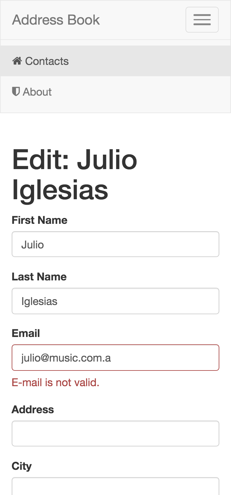

# Challenge

## Client Side Address Book
Build a single page address book application using JavaScript, HTML and CSS.

### Functionality
1. You should be able to add, delete and edit contacts.
2. The data shall be stored in local storage, and loaded again when the application starts.
3. Add fitting validation to the different input fields.

### Form Fields
* First name (required)
* Last name (required)
* Email (required, valid email)
* Address (optional)
* City (optional)
* Zip-code (optional, but if entered it should match `/^\d{5}$/`)
* Country (optional)

### Frameworks/Libraries
* The application **must** be build with [Angular 1](https://angularjs.org/) or [Angular 2](https://angular.io/) 
* You **must not** use jQuery
* The application must be hand-coded and **must not** use any seed or scaffolding tool like Yeoman
* Other libraries and tools like [Lodash](https://lodash.com/) and [Gulp](http://gulpjs.com/) may be used

### Misc
* Even though this is a small project, structure and architecture should mimic a bigger project
* The application should work in latest Chrome, Firefox, Safari and IE
* Application should be written in ES5 or ES2015 (ES6)
* CSS preprocessors are okay to use — we like [Stylus](https://learnboost.github.io/stylus/)

# Solution

## Getting Started

To get you started you can simply clone the address-book-angular repo and install the dependencies:

## Install Dependencies

You will need node.js installed to run this sample app, I recommend [Node Version Manager](https://github.com/creationix/nvm). Check out the repo for installation directions: [nvm github](https://github.com/creationix/nvm)

* Install the server side node libraries we depend upon via ```npm```, the [node package manager](https://www.npmjs.org/).

I have preconfigured the app using ```npm``` to automatically run ```bower``` so you can simply do:

```
  npm install
```

This creates a ```node_modules``` folder which contains the npm packages installed in the previous step

## Run the Application

I have preconfigured the project with a simple development web server. The simplest way to start this server is:

```
  npm start
```

Now pull up your application at ```http://localhost:8000/```.

## Screenshots

I used Bootstrap Tweeter as a design framework. You should see something like this:

Index page


Edit contact page (with error validation)


About page


## Miscaleus

### E-mail validation

I used the following regular expression for e-mail validation.

```
   /^[A-Z0-9._%+-]+@[A-Z0-9.-]+.[A-Z]{2,4}$/i
```

This is not perfect but I don't want to make this example too complicated.

### Sort alphabetically

List of addresses on index page is sorted alphabetically by First Name then by Last Name.

### Main Menu

Please note that top-right menu stays highlighted accordingly.

### jQuery

I don't use jQuery. It is here because Bootstrap needs it.

### Vendors

All external stuff is stored in vendor folder. All application components are locally available.

### Mobile first

Mobile first so because of Boostrap capabitlity it is responsive design.


